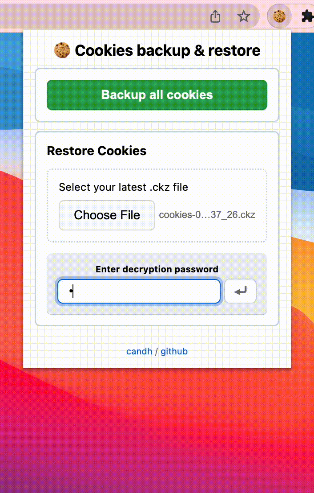

# cookies-backup-chrome

    

---

Want to change machines or want to do a fresh OS install but don't want to re-sign-in to everything you ever signed in? Use this extension!

Backups Chrome Cookies, Encrypts them and Restores them when needed. Simple, Secure and Easy to Use.

    

Encryption is done using [sjcl](https://bitwiseshiftleft.github.io/sjcl/)
